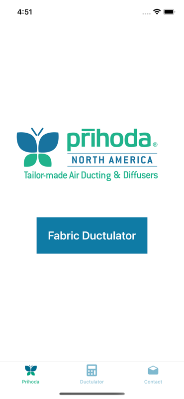
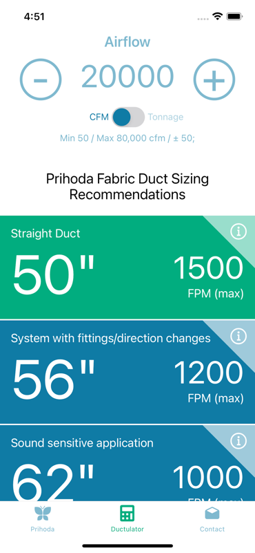
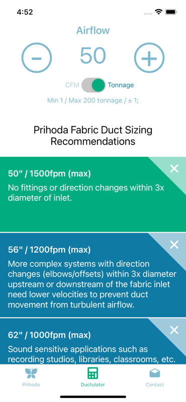

# Fabric Ductulator

Available on [Google Play]() and [Apple App Store](https://apps.apple.com/us/app/fabric-ductulator/id6477066235)

## Screenshots

| Home | CFM | Tonnage |
| :---: | :---: | :---: |
||||

## Purpose
The Fabric Ductulator will help determine the recommended diameter for a given volume of air by Cubic feet per minute or tons of cooling (400 cfm per ton). 

This calculator is intended for preliminary planning only. Since all Prihoda fabric duct systems are made to order, the final design and specifications should be made only after consultation with a certified Prihoda North America representative or a design specialist on our direct sales team. Our comprehensive AirTailor® design software and planning process can help you determine the best design and exact specifications for your particular project. If you’ve already developed plans and would like to request a detailed quote, you can send us your specifications using the detailed quote request form here.